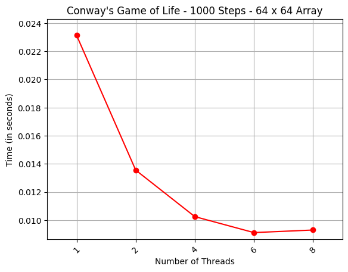
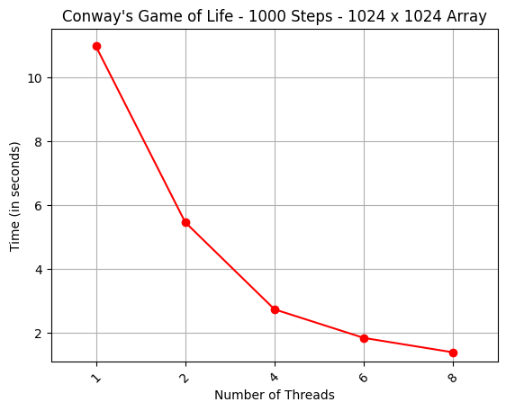
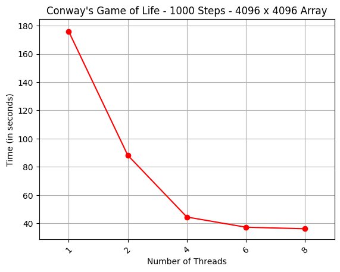
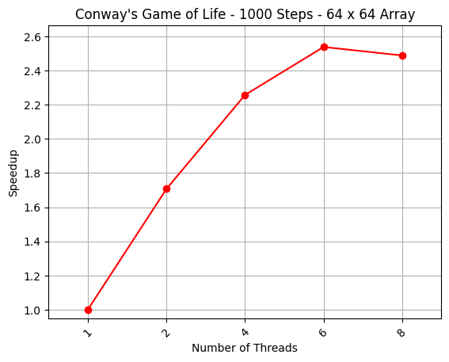
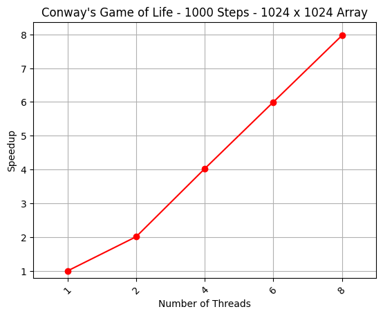
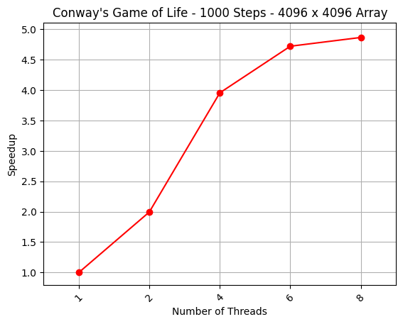

# Lab 1 - Conway's Game of Life

Απλή άσκηση με κύριο σκοπό την εξοικείωσή μας με τα εργαλεία/μηχανήματα του εργαστηρίου. Χρήση του OpenMP για παραλληλοποίηση του αλγορίθμου Game of Life.

O αλγόριθμος δίνεται έτοιμος και εμείς απλά προσθέτουμε το κατάλληλα #pragma directive ώστε να παραλληλοποιηθεί σωστά ο αλγόριθμος χωρίς να έχουμε απώλειες επίδοσης λόγω κακής διαχείρισης shared/copied μεταβλητών.

## Time

    
    
    

## Speedup

    
    
    

