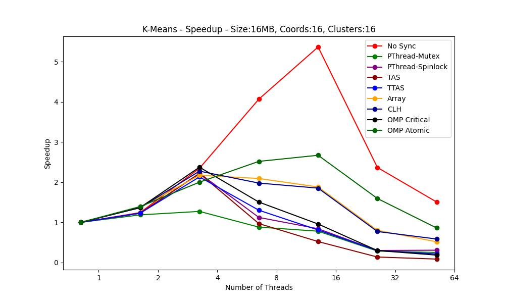

# Lab 3 - Mutual Exclusion - Locks

In the previous problem we studied, specifically in the implementation with a shared array structure, we use the directive **#pragma openmp atomic** to resolve the race-condition. In this exercise, we study other synchronization methods to achieve mutual exclusion. We measure their performance and decide on the optimal solution for the problem. Ultimately, we understand how to build NUMA-aware, scalable spin-locks and the importance of choosing the right lock for each problem.

    
    

The main conclusion is that there is no "best" lock. Each implementation has a reason for use, it always depends on the problem we encounter. Sometimes the most over-engineered solution is NOT the best one!