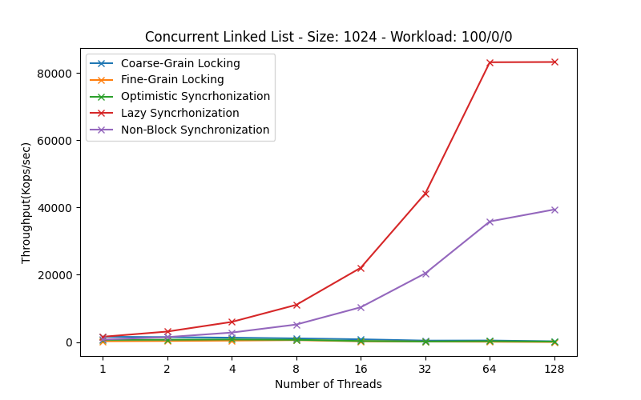
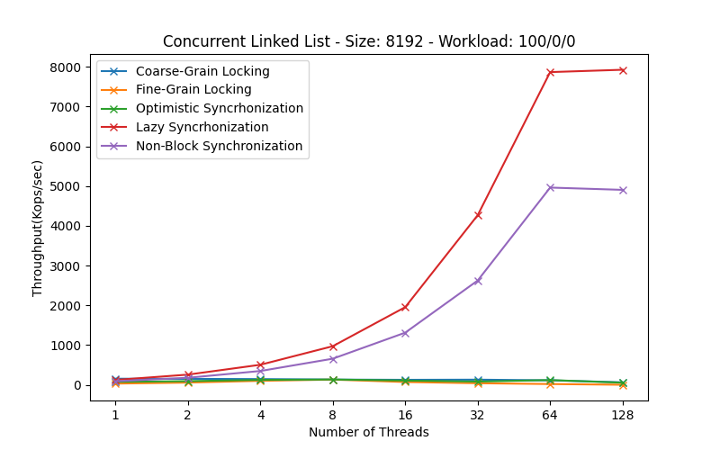

# Lab 4 - Concurrect Data Structures

Having understood how to create a scalable spin-lock, we proceed to see how we can ensure the safety of using a data structure by multiple threads simultaneously. In this exercise, we examine locks in a singly linked list. The experiments are conducted for different workload percentages, i.e., for different percentages of executing contains, add, or remove, the usual operations we perform on such a structure.

    
    

The conclusions of the exercise are similar to those of the previous one, there is not always an optimal solution, each problem requires the correct choice of structures and locks.
